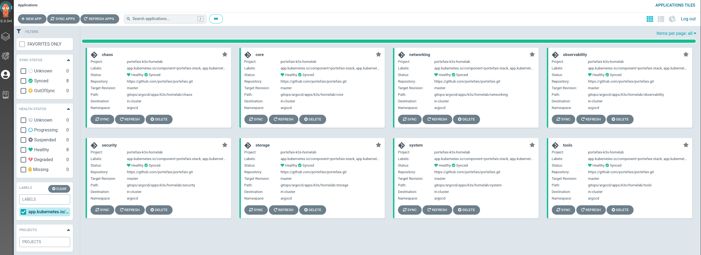
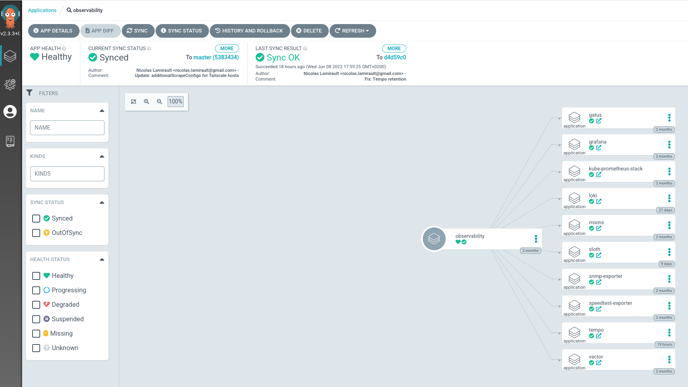
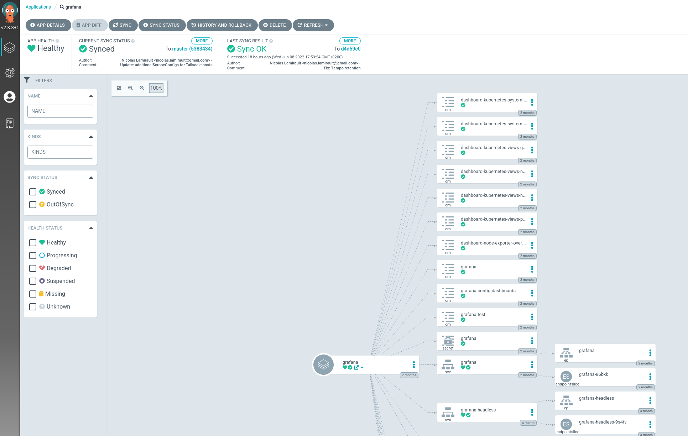

+++
title = "ArgoCD"
description = "Gitops model for Kubernetes using ArgoCD"
weight = 20

+++


## Organization

* `gitops/argocd/bootstrap` : Argo-CD deployment
* `gitops/argocd/stacks` : Portefaix stacks : Argo-CD projects and applications
* `gitops/argocd/apps/<CLOUD>/<ENVIRONMENT>` : Argo-CD applications deployed into the Kubernetes cluster
* `gitops/argocd/charts` : Helm charts configurations

To configure the Helm charts, we use YAML files :

* `values.yaml`: common configuration to all Kubernetes cluster
* `values-<CLOUD>-<ENVIRONMENT>.yaml` : configuration of the Helm chart for a Kubernetes cluster

## Bootstrap

### Argo-CD

```shell
❯ make argocd-bootstrap ENV=<environment> CLOUD=<cloud provider> CHOICE=helm
```

### Stacks

Install a stack into the cluster:

```shell
❯ make argocd-stack-install ENV=<environment> CLOUD=<cloud provider> STACK=<stack name>
```

Stacks:

* Core
* System
* Networking
* Security
* Observability
* Chaos
* Tools



You can list stack installed:

```shell
❯ helm list -A
NAME    NAMESPACE       REVISION        UPDATED                                         STATUS          CHART           APP VERSION
argo-cd argocd          1               2022-06-08 07:40:20.039787662 +0200 CEST        deployed        argo-cd-1.0.0   4.5.0
core    argocd          1               2022-06-08 07:42:03.285558277 +0200 CEST        deployed        stack-0.1.0     0.1.0
system  argocd          1               2022-06-08 07:41:21.749647011 +0200 CEST        deployed        stack-0.1.0     0.1.0
```

Argo-CD applications installs others Argo-CD applications:





Go to Argo-CD dashboard, you will see Argo-CD corresponding applications.

You can list **Stack** applications using the labels `app.kubernetes.io/component: portefaix-stack`

